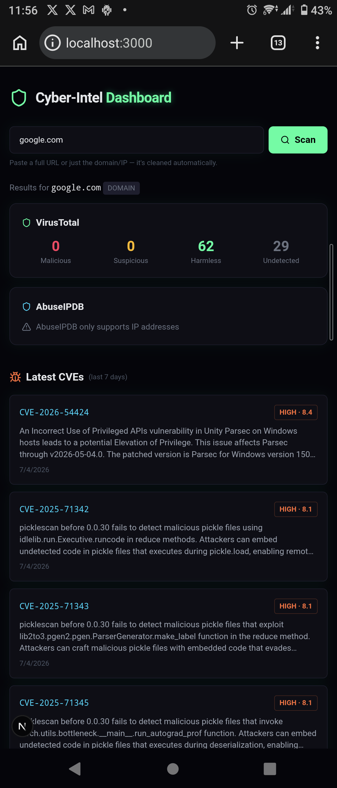

# Cyber-Intel Dashboard

Note: the screenshot above includes the phone's status bar and browser chrome, that's intentional. This entire project was built on an Android phone using Termux and code-server, without a computer.

## Why I built this

As a web developer passionate about cybersecurity, I wanted a fast, reliable way to check the reputation of domains and IP addresses on the go. Cyber-Intel Dashboard is my personal, mobile-friendly tool for instant threat intelligence lookups.

## Features

- Instant lookups: Check domain and IP reputation via VirusTotal and AbuseIPDB.
- Smart input cleaning: Paste a full URL and it's automatically parsed into a clean domain or IP.
- Live CVE feed: Track the latest publicly disclosed vulnerabilities via the NVD API.
- Dark and neon UI: A terminal-inspired dark theme designed to reduce eye strain.
- 100% mobile-built: Developed entirely on a smartphone via Termux and code-server.

## Tech stack

Next.js, TypeScript, Tailwind CSS, Lucide React, VirusTotal API, AbuseIPDB API, NVD API

## Getting started

Run npm install then npm run dev. Add your API keys to .env.local as VT_API_KEY and ABUSEIPDB_KEY.

## Note

This project is for personal and educational use only, in line with the free-tier terms of the APIs used.

---

# Cyber-Intel Dashboard (Francais)

## Pourquoi ce projet

En tant que developpeur web passionne par la cybersecurite, je voulais un moyen rapide et fiable de verifier la reputation d'un domaine ou d'une adresse IP en deplacement. Cyber-Intel Dashboard est mon outil personnel, pense pour le mobile, pour obtenir des renseignements de menace instantanes.

## Fonctionnalites

- Verification instantanee de la reputation des domaines et IP via VirusTotal et AbuseIPDB.
- Nettoyage intelligent des entrees: collez une URL complete, elle est transformee automatiquement en domaine ou IP propre.
- Flux de CVE en direct: suivez les dernieres vulnerabilites publiees via l'API NVD.
- Interface sombre et neon inspiree du terminal pour reduire la fatigue oculaire.
- Developpe a 100% sur mobile via Termux et code-server.

## Stack technique

Next.js, TypeScript, Tailwind CSS, Lucide React, VirusTotal API, AbuseIPDB API, NVD API

## Demarrage

Executez npm install puis npm run dev. Ajoutez vos cles API dans .env.local: VT_API_KEY et ABUSEIPDB_KEY.

## Remarque

Ce projet est destine a un usage personnel et educatif uniquement, conformement aux conditions d'utilisation gratuites des APIs utilisees.
